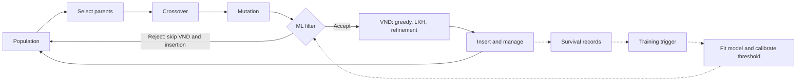

# Assessing the Viability of Pre-Local-Search Surrogate Filtering: A Diagnostic Study of Survival-Based Offspring Pruning in Memetic CETSP

[](https://en.cppreference.com/w/cpp/17)
[](https://www.python.org/)
[](LICENSE)
[](https://www.gurobi.com/)
[](http://akira.ruc.dk/~keld/research/LKH/)

This repository provides the official implementation, experimental benchmarks, and diagnostic reproducibility suite for the research paper:

> **Assessing the Viability of Pre-Local-Search Surrogate Filtering: A Diagnostic Study of Survival-Based Offspring Pruning in Memetic CETSP**<br>
> *Demir Balemir and Deniz Cantürk*<br>
> Department of Computer Engineering, TED University, Ankara, Türkiye<br>
> Target journal: *Expert Systems with Applications* (Elsevier)

The study investigates whether an offspring's pre-local-search features can support useful pruning decisions before an expensive local-search stage in a memetic algorithm for the **Close-Enough Traveling Salesman Problem (CETSP)**. Evaluating nine survival models against a concurrent in-run no-filter control on 53 benchmark instances with five seeds per configuration (2,650 island-runs), the experiment finds **no statistically detectable difference in solution quality or total runtime**.

To investigate this outcome, the paper presents diagnostic analyses of target predictability, rank transmission through local search, and discrimination beyond temporal drift. These motivate a **one-sided viability gate**, assessed retrospectively in the tested system.

---

## Key Empirical & Diagnostic Findings

The end-to-end experiment and the offline diagnostics use different samples:

| Analysis | Sample | Main observation |
|---|---|---|
| End-to-end filtering | 53 test instances × 5 runs × 10 islands = 2,650 island runs | No statistically detectable quality or runtime difference under the evaluated protocol |
| Model and oracle diagnostics | 5 instances; 17,568 recorded solutions | Model-mean concordance approximately 0.495–0.544; post-VND empirical oracle reference 0.687 |
| Full-VND rank–gain calibration | 25 instances | Mean recorded-cohort rank–gain coefficient 0.889; observed direct cost-rank concordance 0.560 |
| Stage-wise local-search measurements | 3 instrumented instances | Instance-dependent transmission of cost ordering through greedy, LKH and refinement stages |

Quality comparisons cover all 53 test instances; runtime tests use the 47 with at least one recorded rejection. Tests pair instance-level means, while island seeds differ by island ID. Runtime is to the stopping rule under concurrent-island contention, rather than to a common solution-quality target. The absence of statistical significance does not establish equivalence.

Among the 2,385 ML island runs, 1,533 reached the nominal 1,000-iteration training floor; three ended exactly at that boundary. The median post-floor window was 1,083 iterations, approximately 52% of run length. Reaching the floor is distinct from having a non-empty active filtering window.

The diagnostics are conditional on recorded, admitted, positive-lifetime solutions. Unadmitted offspring and terminal control survivors are absent, and reconstructed cohorts are incomplete. The five-instance sample includes one development instance; the 25-instance sample includes eight. Their memberships are recorded in the [instance manifest](analysis_la_cetsp/results/instance_manifest.csv).

The oracle is a fitted empirical reference, not a formal prediction ceiling or proof that survival is inherently unpredictable. Rank–gain association alone does not establish rank destruction or filtering infeasibility. Clock comparisons contextualise the measured discrimination; within-time evaluation and time-plus-feature controls remain future work. See [paper/README.md](paper/README.md) for the protocols and limitations.

---

## The Three-Check Viability Gate

| Check | Measurement | Evidence in this study |
|---|---|---|
| Target predictability | Fit an empirical oracle using recorded post-step information | Oracle concordance 0.687 |
| Rank transmission | Assess input-output ordering alongside Spearman(input cohort rank, relative gain) | Full-VND coefficient 0.889; cost-rank concordance 0.560 |
| Discrimination beyond drift | Compare candidate features with a matched iteration-index control | Best tested feature representation 0.605; clock 0.613 |

**One-sided interpretation:** adverse findings can support reconsidering the tested design; favourable findings justify further evaluation without establishing net benefit. The gate has been applied retrospectively in one pipeline. Prospective validation and matched-rate random-pruning comparisons remain future work; no universal cut-point is claimed.

---

## System Architecture

The solver embeds surrogate filtering into the state-of-the-art MA-CETSP algorithm (Lei & Hao, 2024):



Population fitness combines cost rank and diversity rank as
$(1-\beta)r_{val}+\beta r_{div}$. Rejected offspring bypass VND and insertion;
their rejection does not advance the stagnation counter.

### Components
- **Pre-Local-Search Features (10):** Pre-VND tour cost, edge length mean and variance, bounding box width, height, and area, centroid coordinates $(x, y)$, sum of point-to-centroid distances, and interior turning angle variance.
- **Nine Survival Model Families:**
  - *Cox Proportional Hazards (Cox PH)*: Semi-parametric linear baseline, implemented natively in C++.
  - *ElasticNet Cox*: Regularised linear Cox model for collinear feature sets.
  - *Random Survival Forests (RSF)*: Ensembled survival trees via bagging.
  - *Gradient Boosting Survival Analysis (GBSA)*: Stagewise Cox partial-likelihood boosting.
  - *DeepSurv*: Multilayer neural network (2 hidden layers, 64 units, batch norm, dropout).
  - *Multi-Task Logistic Regression (MTLR)*: Neural network discretising the time axis into logistic models.
  - *Survival Support Vector Machines (SSVM)*: Structured ranking formulation for censored pairs.
  - *Weibull Accelerated Failure Time (Weibull AFT)*: Parametric log-survival regression.
  - *$k$-NN Survival*: Non-parametric risk estimator using the 15 nearest neighbours.
- **Resident Process IPC:** Non-Cox models are served by a resident Python process communicating over standard anonymous I/O pipes via single-line JSON requests, removing interpreter start-up overhead.
- **Adaptive Training Trigger:** Fires when both $\text{iter} \ge 0.20 \cdot T$ and $\#\{\text{observed evictions}\} \ge 100$, with a hard fallback at $0.50 \cdot T$. The trigger does not alter or reset the stagnation counter.
- **Threshold Calibration:** Selected on a held-out 20% validation split by maximising regularised survival gap:
  $$J(r, g) = g \cdot \min\left(1, \frac{r}{r^*}\right) - \lambda \max(0, r - r^*)$$
  with target rejection rate $r^* = 0.20$ and penalty $\lambda = 2$.
- **Rolling Rejection-Rate Cap:** Suspends filtering for the next window if the rejection rate exceeds 30% over a window of 50 ML-eligible offspring.
- **Parallel Multi-Island Portfolio:** 10 concurrent threads (9 ML models + 1 in-run unfiltered control), seeded with $\sigma + i$. No migration occurs between islands. The control shares the machine and stopping rules; timing is subject to contention and island seeds are offset.
- **Stagnation Neutrality:** Rejected offspring bypass VND entirely and neither increment nor reset the non-improving stagnation counter $\pi$.

---

## Experimental Setup & Full Results

### Execution Environment
- **CPU:** Intel Core i7-12700H (14 cores / 20 threads, 2.7 GHz, 32 GB DDR4 RAM)
- **OS:** Windows 11 Pro (26200)
- **Compiler:** MSVC 2022 (C++17, `/O2`), CMake 4.2
- **Solvers:** Gurobi 12.0.3, LKH 2.0.11
- **Python:** 3.10.9 (scikit-survival 0.25.0, lifelines 0.30.0, scikit-learn 1.7.2, PyTorch 2.11 CPU, pycox 0.3.0)

### Benchmark Results (53 Instances $\times$ 5 Seeds = 2,650 Island-Runs)

| Model | Class | Mean Best Cost | Degradation (%) | Speedup | Reject (%) | Wilcoxon Quality ($p$) | Wilcoxon Speed ($p$) |
|---|---|---|---|---|---|---|---|
| **Baseline (no ML)** | Control | 905.956 | +0.000% | 1.000 | 0.00% | — | — |
| **RSF** | Tree ensemble | 906.253 | -0.009% | 1.008 | 2.01% | 0.944 ($n=39$) | 0.150 ($n=47$) |
| **KNN** | Non-parametric | 905.867 | -0.003% | 1.040 | 5.03% | 0.313 ($n=38$) | 0.949 ($n=47$) |
| **ElasticNet** | Penalised linear | 906.214 | +0.001% | 1.055 | 5.38% | 0.640 ($n=39$) | 0.841 ($n=47$) |
| **WeibullAFT** | Parametric AFT | 906.025 | +0.002% | 1.051 | 4.85% | 0.557 ($n=38$) | 0.657 ($n=47$) |
| **GBSA** | Gradient boosting | 906.026 | +0.009% | 1.019 | 4.70% | 0.361 ($n=41$) | 0.208 ($n=47$) |
| **DeepSurv** | Deep network | 906.048 | +0.011% | 1.030 | 4.21% | 0.572 ($n=40$) | 0.290 ($n=47$) |
| **MTLR** | Deep network | 905.969 | +0.014% | 1.033 | 4.42% | 0.888 ($n=36$) | 0.498 ($n=47$) |
| **SSVM** | Kernel / ranking | 906.248 | +0.018% | 1.084 | 6.51% | 0.464 ($n=40$) | 0.236 ($n=47$) |
| **Cox PH** | Linear | 906.415 | +0.049% | 1.041 | 8.24% | 0.567 ($n=39$) | 0.857 ($n=47$) |

*Degradation averages matched run-level cost ratios $100(f_{mi} / f_{0i} - 1)$. Wilcoxon tests use per-instance mean differences (53 instances for quality; 47 instances with rejections for speed). All $p \ge 0.05$.*

---

## Repository Structure

```
MA-CETSP/
├── Article.pdf                   # The complete manuscript PDF (19 pages, cas-dc format)
├── src/                          # C++ Solver implementation
│   ├── Algo.cpp                  # Main memetic search loop & stopping logic
│   ├── Genetic/                  # Population management, crossover, mutation
│   ├── LocalSearch/              # VND, greedy adjustment, LKH interface
│   ├── ML/                       # SurvivalModel C++ bridge & native Cox
│   └── Features/                 # Geometry & cost feature extractors
├── include/                      # C++ header files & global parameters (Defs.hpp)
├── ml/
│   ├── scripts/                  # Model training, prediction, threshold calibration
│   └── models/                   # Serialised models and training logs
├── datasets/                     # 68 CETSP benchmark instances (Mennell & Car-door)
├── solutions/                    # Best-known tours and solution logs
├── external/
│   └── LKH-2.0.11/               # Bundled Lin-Kernighan-Helsgaun solver
├── analysis_test/                # Parsed end-to-end experiment records (2,650 runs)
│   ├── parsed/                   # Run summaries, rejections, thresholds, convergence
│   └── results/                  # Model comparisons, Wilcoxon tests, threshold stats
├── analysis_la_cetsp/            # Diagnostic analyses & retained measurement CSVs
│   ├── make_figures.py           # Generates data figures; Figure 1 is TikZ in main.tex
│   ├── oracle_ceiling.py         # Empirical oracle reference
│   ├── lkh_character.py          # LKH rank-gain contraction analysis
│   └── calibrate_recorded_cohorts.py # Full-VND copula sensitivity analysis
├── tools/                        # Reproduction & verification tools
│   ├── export_paper_results.py   # Rebuilds paper tables and LaTeX input fragments
│   ├── test_diagnostic_metrics.py# Unit tests for rank concordance metrics
│   ├── texcheck.py               # LaTeX document integrity checker
│   └── prepare_anonymous_submission.py # Double-anonymized submission generator
├── paper/                        # Complete LaTeX manuscript sources
│   ├── main.tex                  # Local source of truth (cas-dc template)
│   ├── references.bib            # Canonical bibliography (54 entries)
│   ├── figures/                  # Data figures as PDF/PNG; Figure 1 is in main.tex
│   ├── generated/                # Exported LaTeX input fragments
│   └── submission/               # Cover letter, title page, editor info
├── run_experiment.ps1            # Automated PowerShell experiment runner
├── CMakeLists.txt                # CMake build configuration
└── README.md                     # This file
```

---

## Installation & Build Instructions

### Prerequisites
- **C++17 Compiler:** MSVC 2022 on Windows. The current inference bridge uses Windows process APIs.
- **Build System:** CMake 3.17+
- **Optimisation Solver:** [Gurobi Optimizer](https://www.gurobi.com/) (recorded version 12.0.3), with a valid licence. Edit `GUROBI_HOME` and the library names in `CMakeLists.txt` for your installation; the current file sets this path directly.
- **Python 3.10+:** Required for survival model training and figure reproduction.

### Python Dependencies
```bash
# Minimal dependencies for result reproduction and plotting:
pip install -r paper/requirements-results.txt

# Full dependencies for online ML model training:
pip install scikit-survival lifelines scikit-learn torch pycox torchtuples numpy pandas scipy matplotlib
```

### Building the Solver
From the repository root:

```powershell
# Windows PowerShell
cmake -S . -B build -A x64
cmake --build build --config Release --parallel
```

With this MSVC build, `MA-CETSP.exe` is generated in `build/Release/`.
The current CMake linkage and inference bridge require platform changes for Linux or macOS.

---

## Running the Solver & Experiments

### Command-Line Usage
Run from `build/Release/` (default paths resolve relative to this directory):

```powershell
Set-Location build/Release

# 1. Single-island unfiltered control on instance index 1 (bubbles1):
.\MA-CETSP.exe -i 1 -s 1 -r 5000 --islands 1 --ml_enable 0

# 2. Single ML model island (e.g., Cox Proportional Hazards):
.\MA-CETSP.exe -i 1 -s 1 -r 5000 --islands 1 --ml_model COX --ml_enable 1

# 3. Full multi-island experiment (9 ML models + 1 in-run control):
.\MA-CETSP.exe -i 1 -s 1 -r 5000 --islands 10
```

### Batch Experiment Execution
To launch additional seeded experiments, run the following from the repository root. These examples do not reproduce the full 53-instance test set:

```powershell
# Run on instance 0 (bonus1000) across all 5 seeds with 10 parallel islands:
powershell -ExecutionPolicy Bypass -File run_experiment.ps1 -Instances 0 -Islands 10 -Iterations 5000

# Run across multiple instances:
powershell -ExecutionPolicy Bypass -File run_experiment.ps1 -Instances 0,1,2,3 -Islands 10 -Iterations 5000
```
Console logs and summary files are written to `solutions/experiment_results/`.
For the reported test set, select instances marked `test` in the [instance manifest](analysis_la_cetsp/results/instance_manifest.csv), map them to `FILENAMES` indices in `include/Defs.hpp`, and use the manuscript parameters. `bonus1000` (index 0) is a development instance. Leave `--ml_model` unset for the default nine-model-plus-control cycle.

### CLI Options Reference

| Parameter | Type | Default | Description |
|---|---|---|---|
| `-i` | `int` | `0` | Instance index into `FILENAMES` in `Defs.hpp` |
| `-s` | `int` | `0` | Base seed (island $k$ receives $s + k$) |
| `-r` | `int` | `200` | Maximum iteration budget $T$ |
| `-p` | `int` | `20` | Population size $\mu$ |
| `-b` | `float` | `0.96` | Diversity balance weight $\beta$ in fitness function |
| `-d` | `float` | `5.0` | Minimum edit distance threshold for admission |
| `-n` | `int` | `50` | Candidate neighbourhood size for local search |
| `--islands` | `int` | `1` | Number of concurrent search threads; use 10 for the nine-model-plus-control configuration |
| `--ml_model` | `string` | `MTLR` | Model: `COX`, `RSF`, `GBSA`, `DEEPSURV`, `SSVM`, `WEIBULLAFT`, `KNN`, `ELASTICNET`, `MTLR` |
| `--ml_enable` | `int` | `1` | Enable ML surrogate filtering (`1` = yes, `0` = no) |
| `--python_exe` | `string` | `python` | Path to Python interpreter for resident worker |
| `--scripts_dir`| `string` | `../../ml/scripts/` | Path to ML Python scripts directory |
| `--lkh_exe` | `string` | `../../external/LKH-2.0.11/LKH.exe` | Path to compiled LKH executable |
| `--lkh_tmp` | `string` | `../../external/LKH-2.0.11/tmp/` | Path to temporary scratch directory for LKH |

---

## Reproducing Article Results

The retained CSVs support rebuilding summary tables, Wilcoxon tests and data figures without rerunning the C++ solver. Diagnostic measurements are reused from released CSVs; recalculating them from individual solutions requires the original logs. Figure 1 is editable TikZ in `paper/main.tex`.

```bash
# 1. Run unit tests for concordance metrics:
python tools/test_diagnostic_metrics.py

# 2. Export paper summary tables and LaTeX macros:
python tools/export_paper_results.py

# 3. Regenerate the data figures from retained CSVs:
python analysis_la_cetsp/make_figures.py

# 4. Verify LaTeX document structure, environments, and citations:
python tools/texcheck.py
```

### Compiling the Manuscript
```bash
cd paper
latexmk -pdf main.tex
```

Or, from the repository root, create the output directory and compile with Tectonic:
```sh
python -c "from pathlib import Path; Path('output/pdf').mkdir(parents=True, exist_ok=True)"
tectonic -X compile paper/main.tex --outdir output/pdf --untrusted
```

### Data availability and reproducibility scope

The [parsed end-to-end records](analysis_test/parsed/) and [diagnostic measurements](analysis_la_cetsp/results/) are released with [input hashes](paper/generated/input_hashes.csv) and a [full-VND run manifest](analysis_la_cetsp/results/kappa_run_manifest.csv). Raw per-solution logs (approximately 3.4 million records) are available from the authors on request via the manuscript contact details. They are not bundled here; exact historical selections for every older probe are also unavailable in the release.

The release supports result-level reproduction, with these limits on reconstructing historical fits. Use `calibrate_recorded_cohorts.py` for current full-VND calibration. The historical `kappa_calibration.py` and some CSV filenames containing `ceiling` retain legacy naming; use the definitions in [paper/README.md](paper/README.md).

---

## Citation

The diagnostic manuscript extends the earlier LA-CETSP conference study: Balemir, Cantürk and Dökeroğlu, IISEC 2026, pp. 364–369, [doi:10.1109/IISEC69317.2026.11418468](https://doi.org/10.1109/IISEC69317.2026.11418468). The manuscript discusses the change from the earlier four-instance evaluation to the current protocol.

```bibtex
@unpublished{balemir2026assessing,
  title   = {Assessing the Viability of Pre-Local-Search Surrogate Filtering:
             A Diagnostic Study of Survival-Based Offspring Pruning in Memetic {CETSP}},
  author  = {Balemir, Demir and Cant{\"u}rk, Deniz},
  year    = {2026},
  note    = {Diagnostic manuscript},
  url     = {https://github.com/DemirBalemir/MA-CETSP-ml-optimization}
}

@article{lei2024effective,
  title   = {An effective memetic algorithm for the close-enough traveling salesman problem},
  author  = {Lei, Zhenyu and Hao, Jin-Kao},
  journal = {Applied Soft Computing},
  volume  = {153},
  pages   = {111266},
  year    = {2024},
  doi     = {10.1016/j.asoc.2024.111266}
}
```

---

## License

This project is licensed under the MIT License - see the [LICENSE](LICENSE) file for details. Bundled external software (LKH 2.0.11) is subject to its original academic license terms.

